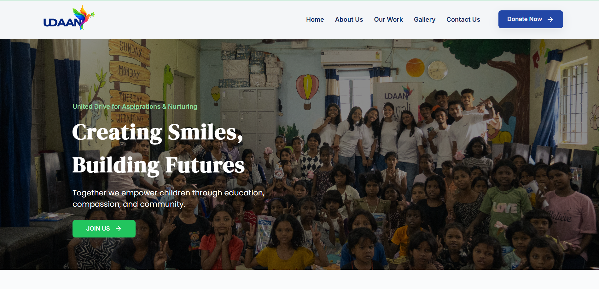
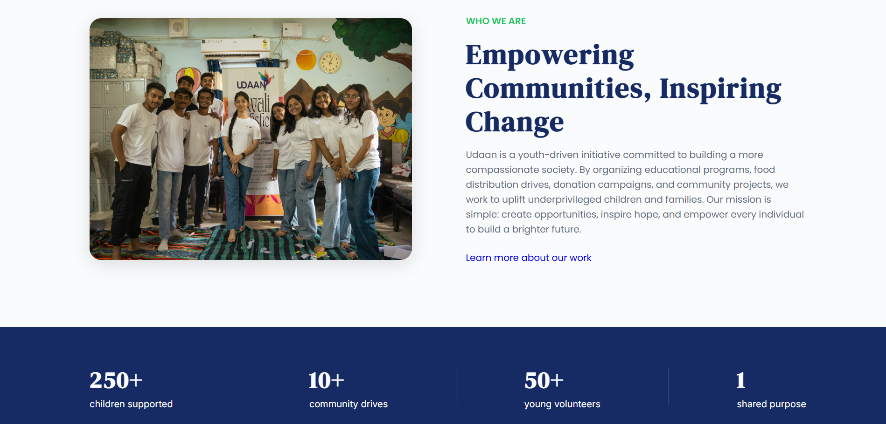
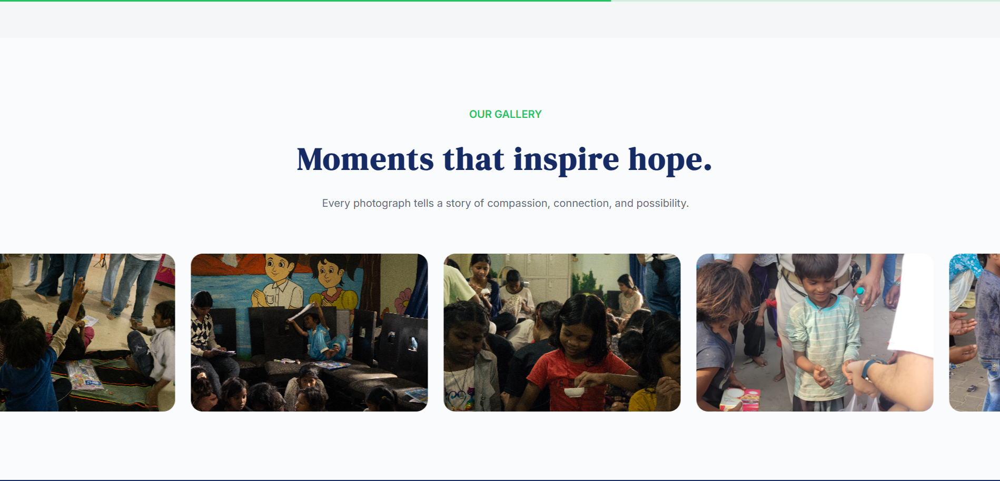
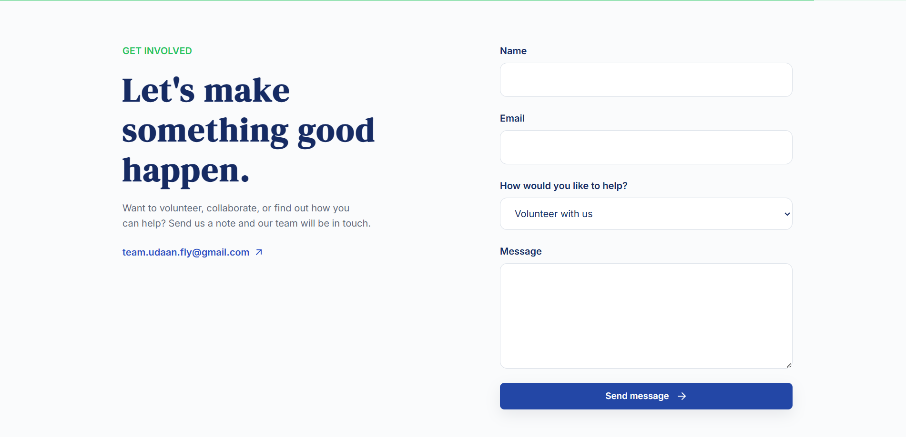

# Udaan - Official NGO Website

A modern, responsive website developed for **Udaan**, a youth-led nonprofit organization dedicated to creating positive social impact through education, compassion, community service, and volunteer-driven initiatives.

The website serves as Udaan's digital presence, showcasing its mission, impact, events, gallery, and ways for individuals to get involved.

---

## 🌟 Features

- Responsive design for desktop, tablet, and mobile devices
- Modern and clean user interface
- Hero section with impactful messaging
- About section introducing Udaan's mission
- Impact statistics section
- Community initiatives showcase
- Infinite scrolling gallery
- Contact & volunteer form
- SEO-friendly metadata
- Optimized images for faster loading
- Accessible navigation and semantic HTML

---

## 🛠️ Built With

- HTML5
- CSS3
- JavaScript
- Cloudflare Pages (Deployment)

---

## 📁 Project Structure

```
udaan-website/
│
├── assets/
│   ├── icons/
│   ├── gallery/
│   ├── icons/
│   ├── img/
│   ├── logo/
│   └── qrcode/
|
├── screenshots/
│
├── css/
│   └── main.css
│
├── js/
│   └── script.js
│
├── pages/
│   └── donation.html
|
├── index.html
└── README.md
```

---

## 📷 Preview








---

## 🚀 Live Website

**Cloudflare Pages**

https://udaan-website-9jr.pages.dev/


---

## 💡 Purpose

This project was created to provide Udaan with a modern digital platform that:

- Introduces visitors to the organization's mission
- Highlights community initiatives and impact
- Encourages volunteering and participation
- Makes information easily accessible across all devices

---

## 📈 Future Improvements

- Multi-language support
- Event management portal
- Blog and news section
- Backend-powered contact form with email notifications
- Website analytics and performance monitoring

---

## 👨‍💻 Developer

**Vaibhav**

Designed and developed as part of my web development learning journey while contributing to a meaningful social initiative.

GitHub: https://github.com/vaibhavvraj

---

## 📄 License

This project is intended for the official use of Udaan.

All rights reserved unless otherwise specified.